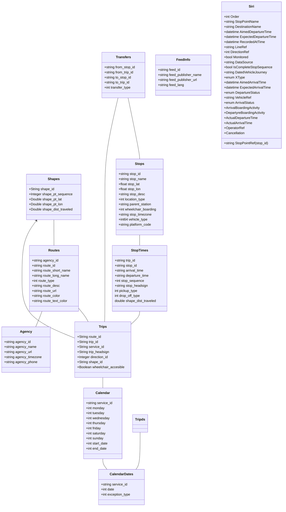

# Data model
Data model for GTFS, SIRI, Real Time

## Diagram

```mermaid
classDiagram
    Shapes <-- Trips
    Shapes -- Routes
    Routes -- Agency
    Routes -- Trips
    Stops -- StopTimes
    StopTimes -- Trips
    Calendar -- CalendarDates
    Trips -- Calendar
    Tripds -- CalendarDates
    Transfers -- Trips
    Transfers -- Stops
    class Shapes {
        +String shape_id
        +Integer shape_pt_sequence
        +Double shape_pt_lat
        +Double shape_pt_lon
        +Double shape_dist_traveled
    }
    class Trips{
        +String route_id
        +String trip_id
        +String service_id
        +String trip_headsign
        +Integer direction_id
        +String shape_id
        +Boolean wheelchair_accesible
    }
    class Routes{
        +string agency_id
        +string route_id
        +string route_short_name
        +string route_long_name
        +int route_type
        +string route_desc
        +string route_url
        +string route_color
        +string route_text_color
    }
    class Agency{
        +string agency_id
        +string agency_name
        +string agency_url
        +string agency_timezone
        +string agency_phone
    }
    class Stops {
        +string stop_id
        +string stop_name
        +float stop_lat
        +float stop_lon
        +string stop_desc
        +int location_type
        +string parent_station
        +int wheelchair_boarding
        +string stop_timezone
        +int64 vehicle_type
        +string platform_code
    }
    class StopTimes {
        +string trip_id
        +string stop_id
        +string arrival_time
        +string departure_time
        +int stop_sequence
        +string stop_headsign
        int pickup_type
        int drop_off_type
        double shape_dist_traveled
    }
    class Calendar {
        +string service_id
        +int monday
        +int tuesday
        +int wednesday
        +int thursday
        +int friday
        +int saturday
        +int sunday
        +int start_date
        +int end_date
    }
    class CalendarDates {
        +string service_id
        +int date
        +int exception_type
    }

    class Transfers {
        +string from_stop_id
        +string from_trip_id
        +string to_stop_id
        +string to_trip_id
        +int transfer_type
    }
    class FeedInfo {
        +string feed_id
        +string feed_publisher_name
        +string feed_publisher_url
        +string feed_lang
    }


    class Siri {
        +string StopPointRef (stop_id)
        +int Order
        +string StopPointName
        +string DestinationName
        +datetime AimedDepartureTime
        +datetime ExpectedDepartureTime
        +datetime RecordedAtTime
        +string LineRef
        +int DirectionRef
        +bool Monitored
        +string DataSource
        +bool IsCompleteStopSequence
        +string DatedVehicleJourney
        +enum XType
        +datetime AimedArrivalTime
        +datetime ExpectedArrivalTime
        +enum DepartureStatus
        +string VehicleRef
        +enum ArrivalStatus
        +ArrivalBoardingActivity
        +DepartyreBoardingActivity
        +ActualDepartureTime
        +ActualArrivalTime
        +OperatorRef
        +Cancellation
    }
```
